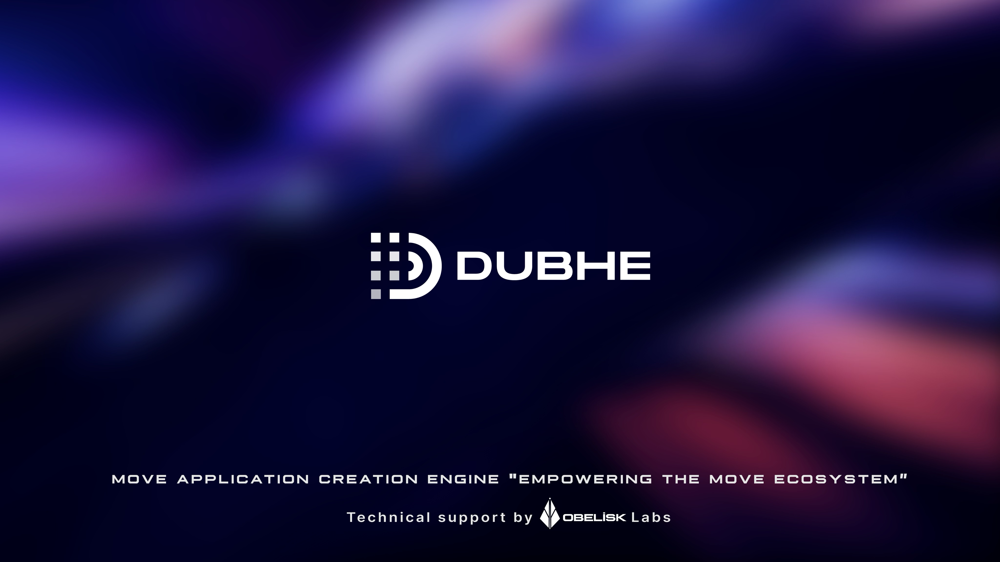

## Dubhe

  
   
  
  

> Dubhe is a community-driven open-source Move Application Creation Engine and Provable Game Engine, providing a comprehensive toolkit for building verifiable dapps/games and autonomous worlds.

Currently in early development, Dubhe aims to reduce project setup time from days to hours through its powerful toolkit and active community contributions.

## 🔑 Key Features
- ⚡️ Built with [Move](https://move-language.github.io/move/)
- 🏛️ Harvard Structural Architecture
- 📦 Structured [Schema-based](https://obelisk.build/engine/docs/schemas/) Storage
- 🌐 Multi-Move Ecosystem Support
- 🛠️ Development Tools:
  - Sandbox Networking & Indexing
  - Type-safe SDKs
  - Hot Updates
  - Logic Upgrades & Data Migration

## 🔮 Roadmap
- 🔐 ZK-login Plugin Integration
- 💰 Transaction Sponsorship Plugin
- 🔄 State Synchronization Client Hooks
- ⚙️ Custom Runtime Sandbox
- 🌍 World Browser Interface

## 📦 Packages

| Package | Description | Version |
|---------|-------------|----------|
| [@0xobelisk/sui-cli](./packages/sui-cli) | Sui CLI for testing, deployment & more |  |
| [@0xobelisk/sui-client](./packages/sui-client) | Sui TypeScript Client |  |
| [@0xobelisk/sui-common](./packages/sui-common) | Sui Core Utilities |  |
| [@0xobelisk/aptos-cli](./packages/aptos-cli) | Aptos CLI Tools |  |
| [@0xobelisk/aptos-client](./packages/aptos-client) | Aptos TypeScript Client |  |
| [@0xobelisk/aptos-common](./packages/aptos-common) | Aptos Core Utilities |  |

## 🗒 Quick Links
- 📚 [Documentation](https://obelisk.build/engine/docs)
- 🚀 [Quick Start Guide](https://obelisk.build/engine/docs/quick-start)
- 💬 [Join our Telegram](https://t.me/+0_98p03Fbv1hNzY1)
- 🐛 [Report Issues](https://github.com/0xobelisk/dubhe/issues)

## Contributors ✨

Thanks goes to these wonderful people ([emoji key](https://allcontributors.org/docs/en/emoji-key)):

<!-- ALL-CONTRIBUTORS-LIST:START - Do not remove or modify this section -->
<!-- prettier-ignore-start -->
<!-- markdownlint-disable -->
<table>
  <tbody>
    <tr>
      <td align="center" valign="top" width="14.28%"><a href="https://github.com/Zombieliu"> <b>Henry</b></a> <a href="https://github.com/0xobelisk/dubhe/commits?author=Zombieliu" title="Code">💻</a></td>
      <td align="center" valign="top" width="14.28%"><a href="https://github.com/web3olalala"> <b>Bob</b></a> <a href="https://github.com/0xobelisk/dubhe/commits?author=web3olalala" title="Code">💻</a></td>
      <td align="center" valign="top" width="14.28%"><a href="https://github.com/vladilen11"> <b>Frank</b></a> <a href="https://github.com/0xobelisk/dubhe/commits?author=vladilen11" title="Code">💻</a></td>
      <td align="center" valign="top" width="14.28%"><a href="https://github.com/tiankonglan"> <b>Lewis</b></a> <a href="https://github.com/0xobelisk/dubhe/commits?author=tiankonglan" title="Code">💻</a></td>
    </tr>
  </tbody>
</table>

<!-- markdownlint-restore -->
<!-- prettier-ignore-end -->

<!-- ALL-CONTRIBUTORS-LIST:END -->

This project follows the
[all-contributors](https://github.com/all-contributors/all-contributors)
specification. Contributions of any kind welcome!
